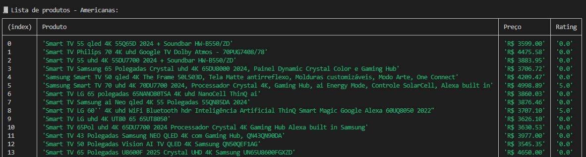
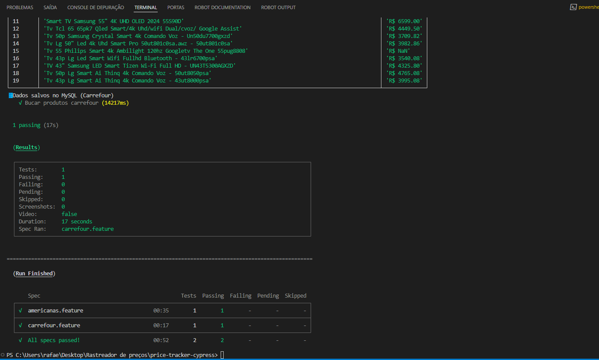
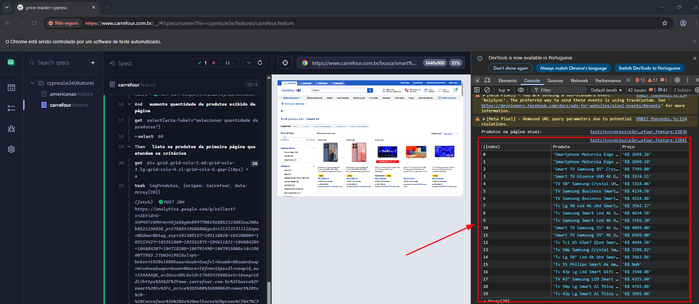
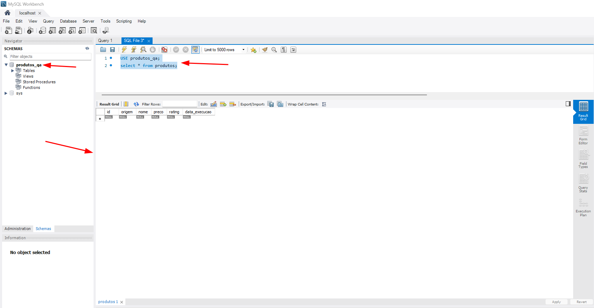
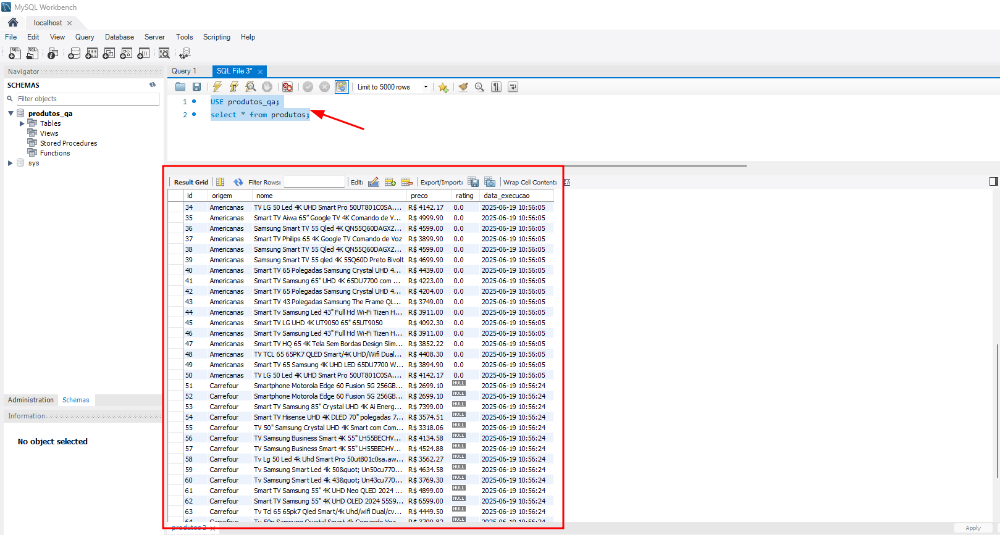

# 🛒 Automação de Comparação de Preços com Cypress


Este projeto tem como objetivo automatizar a busca e comparação de preços de produtos em sites de e-commerce. Utilizando Cypress como framework de testes, a automação realiza buscas por produtos (ex: *Smart TV*), aplica filtros de preço e exibe no console e terminal os resultados em formato de tabela, incluindo nome, valor e (quando disponível) avaliação.


## ✅ Funcionalidades

- Acessa automaticamente os sites de e-commerce (atualmente: Americanas e Carrefour)
- Fecha banners de cookies e promoções, se existirem
- Realiza busca por um produto específico
- Aplica filtros de faixa de preço
- Coleta nomes e preços dos produtos (e avaliação, se disponível)
- Exibe os dados em formato de tabela no console e terminal
- Salva os dados em um banco MySQL local (quando ativado via variável de ambiente)
- Pipeline GitHub Actions configurada para rodar testes automaticamente a cada push na `main`
- Estrutura de testes organizada com **Page Object Model (POM)**


## 🧰 Tecnologias utilizadas

- [Cypress](https://www.cypress.io/) — Automação de testes E2E
- JavaScript
- Node.js
- Cucumber
- Page Object Model
- MySQL + MySQL Workbench


## 🚀 Como executar

```bash
# Clone o repositório
git clone https://github.com/Rafa-eloi/price-tracker-cypress.git

# Acesse o diretório do projeto
cd price-tracker-cypress

# Instale as dependências
npm install

# Execute os testes em modo headless
npx cypress run

# Execute os testes em modo headless e salve os dados no banco (se o banco estiver configurado localmente)
npx cypress run --env gravarNoBanco=true

# Execute os testes com interface
npx cypress open

# Execute os testes com interface e salvando os dados no banco
npx cypress open --env gravarNoBanco=true

```


## 🧾 Exemplo da Tabela no Terminal
Após a execução, os produtos filtrados são exibidos diretamente no terminal com o seguinte formato:

A listagem pode variar de acordo com o filtro aplicado e os produtos disponíveis no momento da execução.


## 🗃️ Estrutura da Tabela no Banco de Dados
Quando a variável gravarNoBanco=true está ativa, os dados são salvos em uma tabela no MySQL com a seguinte estrutura:
```sql
CREATE DATABASE IF NOT EXISTS produtos_qa;

USE produtos_qa;

CREATE TABLE IF NOT EXISTS produtos (
  id INT AUTO_INCREMENT PRIMARY KEY,
  origem VARCHAR(100),
  nome VARCHAR(255),
  preco VARCHAR(50),
  rating VARCHAR(50),
  data_execucao TIMESTAMP DEFAULT CURRENT_TIMESTAMP
);

```

Consulta SQL sugerida:
```sql
SELECT * FROM produtos ORDER BY data_execucao DESC;

```

---

## 📸 Capturas de Tela (Prints)

### 📦 Resultado da execução no terminal


*Tabela gerada no terminal após a execução headless com `npx cypress run`.*

---

### 🧪 Execução dos testes com Cypress aberto


*Interface do Cypress rodando os testes de forma visual e resultado no console do navegador.*

---

### 📋 Tabela vazia no banco de dados (Workbench)


*Tabela vazia antes da execução dos testes em banco local via MySQL Workbench.*

---

### 📋 Resultado salvo no banco de dados (Workbench)


*Tabela preenchida após execução dos testes em banco local via MySQL Workbench.*


## 📌 Observações
O projeto está em constante evolução e pode ser facilmente adaptado para outros sites de e-commerce.

Ideal para fins educacionais, estudos de QA e prática com automação de testes.

⚠️ Os testes relacionados ao site Carrefour estão comentados na pipeline, pois o domínio bloqueia acesso de automações headless em ambiente CI. No entanto, funcionam normalmente em execuções locais com npx cypress run ou npx cypress open.
